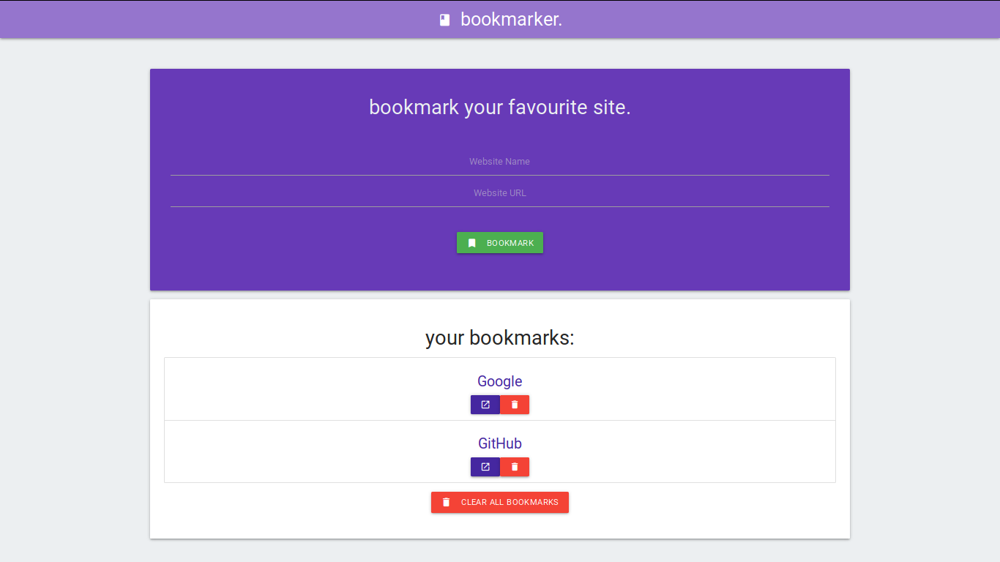

# Bookmark application with Materialize.css front-end
Simple application for storing website urls using nothing but pure JavaScript, Materialize.css and Local Storage.
Front-end was developed using [Materialize.css framework](https://materializecss.com/).

## Live preview 
https://jb0hn.github.io/bookmark-app-js-materialize/

## Acknowledgments
The project was inspired by [Brad Traversy](https://www.traversymedia.com/).

